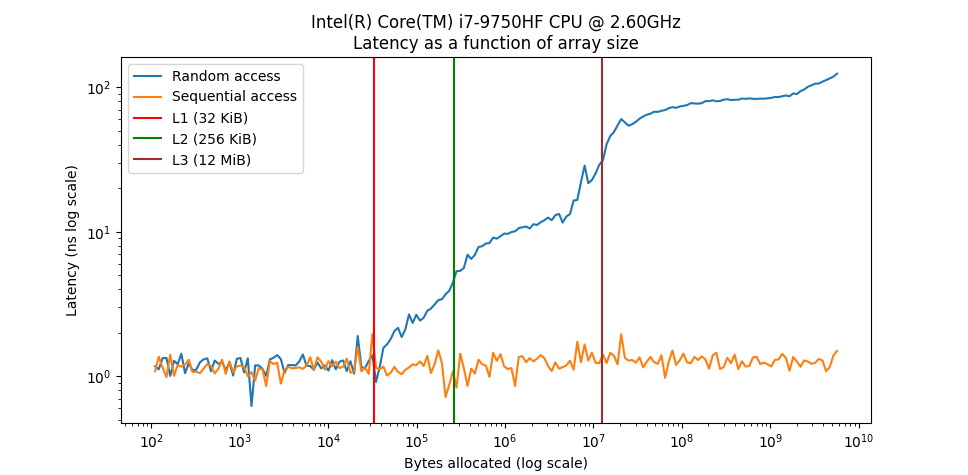

<div align="center">

# Exercise 1 – Memory Access Latency Analysis

**Memory Access Latency** is the first assignment I completed in the *Operating Systems* course at the HUJI.

In this exercise, I measured and compared the performance of **sequential** vs. **random** memory access patterns in C++, demonstrating how **cache locality** and **memory hierarchy** affect access latency.

[**« Return to Main Repository**](https://github.com/ShayMorad/Operating-Systems)

</div>

## Running the Project

To compile and execute the latency analysis locally:

1. Clone the repository:
   ```bash
   git clone <repo_url>
   ```

2. Navigate to the project directory:
   ```bash
   cd Exercise 1
   ```

3. Compile the project using the provided Makefile:
   ```bash
   make
   ```

4. Run the program:
   ```bash
   ./memory_latency
   ```

5. To clean the build files:
   ```bash
   make clean
   ```


##  Summary of Findings

- **Sequential Access**: Latency remains low due to efficient cache usage and spatial locality.
- **Random Access**: Latency increases significantly as array size grows due to frequent cache misses.
- These results demonstrate the importance of memory access patterns in performance-critical systems.
- 


##  Contributions

Contributions are welcome!  For significant suggestions or improvements, please open an issue for discussion.


##  License

This project is licensed under the [MIT License](https://choosealicense.com/licenses/mit/).

